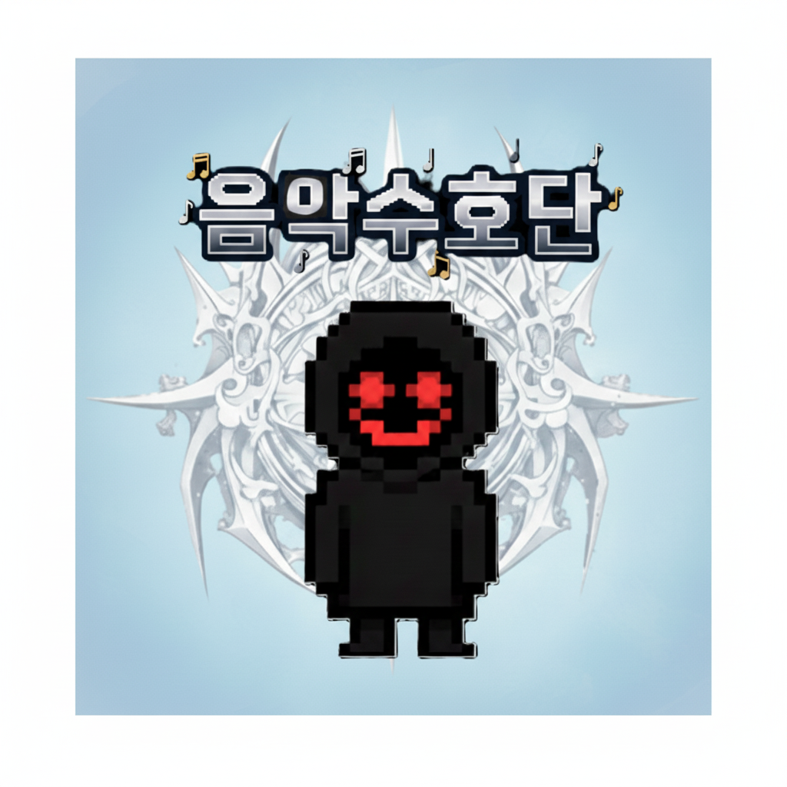

  

  <h1>♬ 음 악 수 호 단</h1>
  <h5>2D Rythm Defence Game</h5>

# 💡 게임 설명
 현재 우리의 세계는 위험에 빠졌습니다. 미확인 생명체들의 공격을 대항할 방법도 없이 도시는 밤의 도시로 변질 되어가고, 당신은 우연히 특별한 능력을 얻어내고 당신과 같은 힘을 가진 사람들을 모아내어 녀석들을 막아냅니다. 하지만 전투 중 적들에게 당하게 되면서 기억을 잃어버립니다. 다행히 동료들에 구조로 당신은 무사할 수 있었고, 기억을 되찾아가며 동료들과 힘을 합쳐 밤의 도시들을 하나하나 해방해나가는 여정을 시작하게 됩니다. 당신은 세계의 구원자 "음악수호단"의 단장입니다. 부디 모두의 힘을 모아 세계를 지켜주세요.
   
 **"우리의 연주가 세상을 구원한다.. 우리는 반드시 지켜내야해."** 

 
# 📺 발표 자료 및 시연 영상

  <h3>✨ 프로젝트 발표 자료 ✨</h3>
  
  | 상태 | 내용 |
  |:---:|:---:|
  | 🔗 **LINK** | **[클릭하여 발표 자료 (PDF) 보기](https://github.com/fndhk/Team-6301/blob/main/ppt/6301%EB%B0%9C%ED%91%9C%EC%9E%90%EB%A3%8C.pdf)** |

  <h3>🎬 게임 시연 영상 🎬</h3>
  
  | 상태 | 내용 |
  |:---:|:---:|
  | 🚧 **LINK** | **[클릭하여 시연 영상 보기](https://www.youtube.com/watch?v=t0QMPtMhZtc)** |

# ⚙ 기술 스택 
| 🎮 | 사용 기술|
|:-----------:|:-----------:|
| **Engine** | ``Unity`` |
| **PL** | `C++`, `C#` |
| **AI** | `SUNO AI`, `VEO`, `GEMINI` |

# 👨🏼‍🤝‍👨🏼 팀원

|  |  |  |  |
|:--------------------------:|:--------------------------:|:--------------------------:|:--------------------------:|
| <strong>곽영민</strong> [팀장] | <strong>김유신</strong> [팀원] | <strong>이재원</strong> [팀원] | <strong>임태형</strong> [팀원] |

