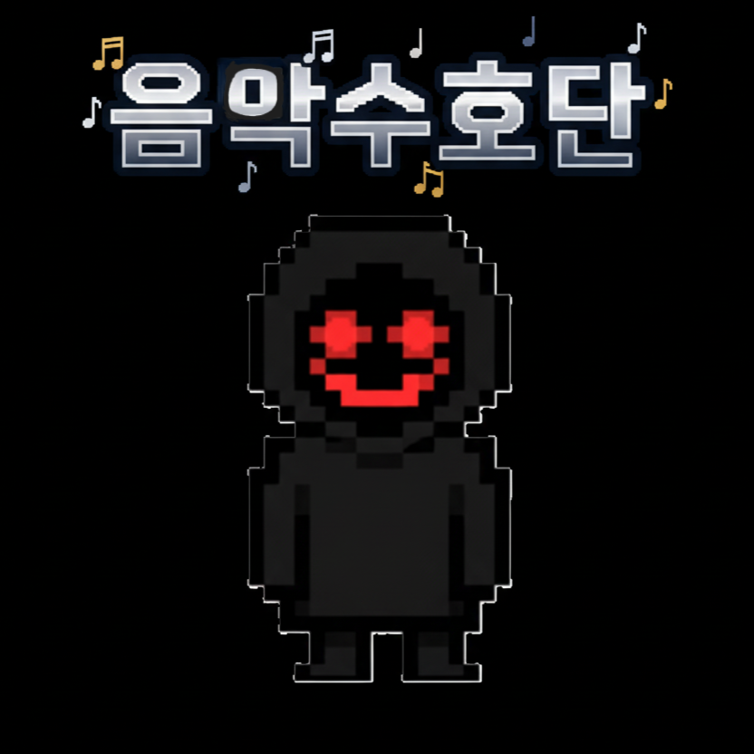

  

  <h1>♬ 음 악 수 호 단</h1>
  <h5>2D Defence Game</h5>

# 📺 시연 영상
-준비중-

# 💡 게임 설명
 현재 우리의 세계는 위험에 빠졌습니다. 미확인 생명체들의 공격을 대항할 방법도 없이 도시는 밤의 도시로 변질 되어가고, 우리 악단은 도시에서 조금 떨어진 잔디공연장에서 마지막 연주를 하기로 하였습니다. 그렇게 잔디공연장에서 마지막 연주를 진행하던 와중 우리는 밤의 인간들이 우리의 연주에 하나 둘 사라지는 것을 발견하였고, 우리는 앞으로의 방향을 발견하게 됩니다.
   
 **"우리의 연주로 세상을 변화시키기 위해.. 우리는 반드시 해내야만 해."** 

# ⚙ 기술 스택 
| 🎮 | 사용 기술|
|:-----------:|:-----------:|
| **Engine** | ``Unity`` |
| **PL** | `C++`, `C#` |
| **AI** | `SUNO AI`, `VEO`, `GEMINI` |

# 👨🏼‍🤝‍👨🏼 팀원

|  |  |  |  |
|:--------------------------:|:--------------------------:|:--------------------------:|:--------------------------:|
| <strong>곽영민</strong> [팀장] | <strong>김유신</strong> [팀원] | <strong>이재원</strong> [팀원] | <strong>임태형</strong> [팀원] |

